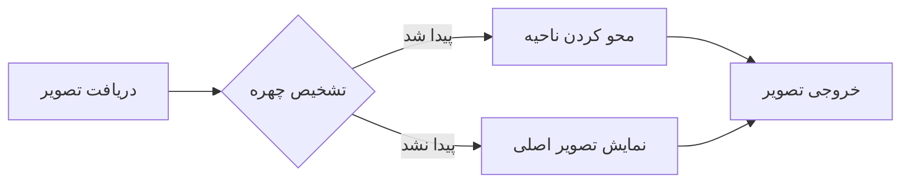

Face Blur API - تشخیص و محو کردن خودکار چهره در تصاویر

یک API ساده و سبک با PHP که به صورت خودکار چهره‌ها را در تصاویر تشخیص داده و آن‌ها را محو می‌کند. مناسب برای رعایت حریم خصوصی در تصاویر.

---

✨ ویژگی‌ها

· تشخیص خودکار چهره با الگوریتم اختصاصی (بدون نیاز به کتابخانه‌های خارجی)
· پشتیبانی از دو روش ارسال: آپلود فایل و لینک مستقیم
· فرمت‌های پشتیبانی‌شده: JPEG, PNG, GIF, WebP
· حداکثر حجم: ۱۰ مگابایت
· محو کردن هوشمند با تکنیک Pixelate + Gaussian Blur
· حذف خودکار فایل‌های موقت بعد از پردازش


پیش‌نیازها

· PHP 7.4 یا بالاتر
· اکستنشن‌های: GD, fileinfo, curl (برای دریافت از لینک)

---

📡 نحوه استفاده

روش ۱: آپلود فایل (POST)

```bash
curl -X POST -F "image=@/path/to/photo.jpg" https://holobot.ir/face-blur.php
```

نمونه فرم HTML:

```html
<form method="post" enctype="multipart/form-data">
    <input type="file" name="image" accept="image/*">
    <button type="submit">محو کردن چهره‌ها</button>
</form>
```

روش ۲: لینک مستقیم (GET)

```bash
curl "https://holobot.ir/face-blur.php?url=https://example.com/photo.jpg"
```

پاسخ API

· موفقیت: تصویر پردازش‌شده مستقیماً نمایش داده می‌شود
· خطا: پیام خطا به صورت متن

---

⚙️ نحوه عملکرد



الگوریتم تشخیص چهره

1. کاهش ابعاد برای پردازش سریع‌تر
2. بررسی پوست با تبدیل RGB به YCbCr
3. تشخیص چشم‌ها با بررسی نواحی تیره
4. تشخیص دهان با الگوی روشنایی
5. بررسی تقارن برای تأیید نهایی
6. حذف تشخیص‌های تکراری با IoU

---

🛠️ سفارشی‌سازی

تنظیم حساسیت تشخیص

```php
// در تابع checkFace، خط ۱۵۵
if ($skinScore < 0.15) {  // کاهش برای تشخیص بیشتر
    return 0;
}
```

تغییر شدت محو شدن

```php
// در تابع blurFace، خط ۴۲۰
$pixelSize = max(5, (int)round($w / 8));  // عدد بیشتر = محوتر
```

محدودیت حجم آپلود

```php
// خط ۹۶
if ($file['size'] > 10 * 1024 * 1024) {  // تغییر 10 به مقدار دلخواه
```

---

📁 ساختار پروژه

```
face-blur-api/
├── index.php          # فایل اصلی API
├── faces/             # پوشه موقت (ایجاد خودکار)
└── README.md          # این فایل
```

---

⚠️ محدودیت‌ها

· دقت تشخیص در تصاویر با کیفیت پایین کاهش می‌یابد
· چهره‌های کوچکتر از ۲۵ پیکسل تشخیص داده نمی‌شوند
· فقط چهره‌های رو به جلو با دقت بالا تشخیص داده می‌شوند

---

🔒 امنیت

· اعتبارسنجی نوع فایل با MIME Type
· محدودیت حجم برای جلوگیری از حملات DoS
· پاکسازی خودکار فایل‌های موقت
· حذف فایل‌ها بعد از هر درخواست

---

🐛 رفع اشکال

خطای "تصویر قابل بارگذاری نیست"

· مطمئن شوید اکستنشن GD فعال است:

```bash
php -m | grep gd
```

خطای "امکان دریافت عکس از لینک وجود ندارد"

· بررسی کنید allow_url_fopen در php.ini فعال باشد:

```ini
allow_url_fopen = On
```

---

📝 مجوز

این پروژه تحت مجوز MIT منتشر شده است.


📞 تماس

· ایجاد Issue در گیت‌هاب برای گزارش باگ یا درخواست ویژگی جدید
· ایمیل: info@RoseSearch.ir

---

⭐ اگر این پروژه برایتان مفید بود، ستاره دادن به مخزن را فراموش نکنید!
